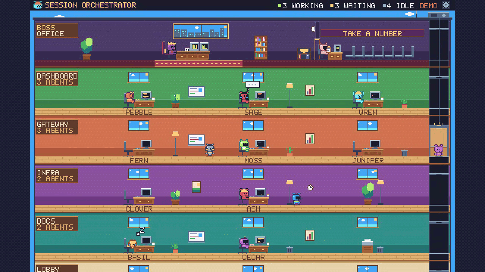

# session-orchestrator

A local-only, retro pixel-art "agent office" for your Claude Code sessions.



<!-- The recording lives at docs/office.gif. Record the office in demo mode (index.html?demo=1&onboarding=0, around 1280x720, 10 to 20 seconds, under 5 MB) so no real project names appear, and replace that one file. -->

Every project folder is a floor, every Claude Code session is a pixel critter at its desk, and a Boss Office sits on top. The orchestrator's queue stands in the Secretary's waiting room, in queue order. An elevator carries agents between floors.

Everything on screen reflects something that really happens:

- Working: the critter types and the CRT scrolls. Waiting: in the orchestrator's queue, standing in the waiting room. Idle: blinks, sips coffee, stretches, and eventually naps.
- You prompt a session directly: the boss gets up, rides the elevator to that session's desk, they exchange a short line, and he goes back to his chair.
- One session messages another: the sender walks to the recipient's desk (via the elevator when on another floor).
- A new session starts: a desk drops in on the project's floor, a dust puff, and the new critter rides up from the Lobby and sits. A brand-new project gets a new floor that slides in.
- `next` (see below): the front of the line gets waved through by the secretary and walks into the Boss Office.

Nothing leaves your machine. See [Privacy](#privacy).

## Install

### As a Claude Code plugin

In a Claude Code session:

```
/plugin marketplace add marginsystems/session-orchestrator
/plugin install session-orchestrator@session-orchestrator
```

Then run `/office` (also available as `/session-orchestrator:office`). It starts `node scan.mjs` in the background if it is not already running and prints the local URL, `http://127.0.0.1:7777`.

From a shell, the same thing is:

```
claude plugin marketplace add marginsystems/session-orchestrator
claude plugin install session-orchestrator@session-orchestrator
```

The repository is private for now, so the marketplace add needs git credentials that can read it.

### Plain `git clone`

```
git clone https://github.com/marginsystems/session-orchestrator
cd session-orchestrator
node scan.mjs
```

Open http://127.0.0.1:7777. Node 18 or newer, no `npm install`.

### Demo, no server

Open `index.html?demo=1` straight from disk. It runs a scripted office with generic names: ten agents in four rooms, a boss queue, boss visits, new sessions joining and the secretary flow. Add `&chaos=0..3` for how much the critters fidget, chat and doze (default 1, 0 turns the layer off, 3 is lively), `&night=1` for dimmed lights, `&hud=0` to hide the header, `&speed=2` to speed it up, `&onboarding=0` to skip the tour. Settings persist in `localStorage` there.

## Run options

```
node scan.mjs                 # serves http://127.0.0.1:7777
node scan.mjs --once          # prints counts only
node scan.mjs --once --json   # prints the state.json snapshot
node scan.mjs --ensure        # starts the server in the background if it is not running
```

Flags: `--port <n>`, `--anonymize-rooms` (rooms become Room A, B, C, for screen recordings), `--show-titles` (shows session titles as name tags above the critters), `--max <n>` (agent cap, default 30; at most 6 agents per room and 12 rooms).

Floors are named after the GitHub repository, or the folder when there is no remote. Session titles are hidden unless you opt in.

## Settings

Click the gear in the header. The panel is a small retro window over the office.

- **Floor priority**: the list of projects. Drag a row, or use the up and down buttons (or the arrow keys on a focused row). Floor order is priority: the highest priority sits right under the Boss Office, the lowest just above the Lobby. The building re-stacks with the floors sliding into place. Projects you have not ordered go below the ordered ones, alphabetically, the same order as the Claude Code sidebar when it groups sessions by project. Floors are named like the sidebar too: the GitHub repository name, or the folder name when there is no remote.
- **Anonymize rooms**: hides project names (Room A, B, C).
- **Show session titles**: shows a small name tag above each critter.
- **Demo speed**: 1x, 2x or 3x, for the demo.
- **Sound**: stored for later, nothing plays yet.
- **Reset onboarding**: replays the tour.

Settings are saved to `~/.session-orchestrator/settings.json` through the loopback server (`GET /settings`, `POST /settings`). `POST` takes a JSON object with only the known keys (`order`, `anonymize`, `titles`, `speed`, `sound`, `onboardedAt`), is limited to 4 KB, requires `Content-Type: application/json`, and is accepted only from the same origin. Without a server (demo, or a copy of the page opened from disk) settings fall back to `localStorage`.

## Onboarding

The first time you open the office, the Boss walks you through six short steps: your office, floors and critters, the three states, setting priorities (you drag a floor, and confetti follows), the boss queue and `next`, and the privacy promise. Skip any time with Skip or Esc. Add `?onboarding=1` to force it, or `?onboarding=0` to suppress it.

## Orchestrator: `/orchestrate` and `/next`

Run `/orchestrate` in one session to make it the orchestrator; running it in another session hands the job over. In that session, `/next` brings the front of the queue into the Boss Office.

## The `next` contract

An orchestrator session (or anything else) writes `~/.session-orchestrator/focus.json` when you want a session brought to the boss:

```
{"sessionId": "local_...", "at": "2026-10-06T12:00:00Z"}
```

`sessionId` may be a desktop `local_...` id or a transcript uuid. `scan.mjs` only reads the file, never writes it, maps the id to an agent the same way message senders are mapped, and adds `focus: {agentId, at}` to `state.json`. The secretary waves that agent through, it walks into the Boss Office, stands in front of his desk and says a generic line while the boss looks up. It goes back to its desk when focus changes or clears. An unknown session sends a Guest up from the Lobby. A missing file or one older than 24 hours means no focus.

The waiting room is the orchestrator's queue. The orchestrator writes it to `~/.session-orchestrator/queue.json` whenever the queue changes:

```
{"at": "2026-10-06T12:00:00Z", "orchestrator": "local_...", "items": [{"sessionId": "local_..."}, {"sessionId": null}]}
```

`orchestrator` is the orchestrator session's own id: prompts typed there do not send the boss out of his office.

Every item stands in the waiting room in that order, front first, so a long queue is a crowded room: queued sessions that are on screen walk up from their desks, and items without a session (or whose session is not on screen) stand there as guests. `state.json` gives the full line in `line`, an agent id or `null` per item. `scan.mjs` only reads the file. A missing file or one older than 24 hours means an empty waiting room. `state.json` lists the queued agents in `queue` and the total number of items in `queue.json`, including items without a session, in `queueSize`.

## state.json

```
{
  generatedAt,
  rooms:  [{id, label}],
  agents: [{id, name, room, state, title?}],
  events: [{id, kind: "message", at, from, to}
         | {id, kind: "boss_visit", at, to}
         | {id, kind: "join", at, agentId}],
  focus:  {agentId, at} | null,
  queue:  [agentId, ...],
  queueSize: number
}
```

- `rooms` are already in priority order.
- A `boss_visit` is emitted for a genuine human prompt in a transcript. Tool results, cross-session messages, task notifications, system reminders, scheduled-task wrappers and other injected turns do not count (`lib/prompts.mjs`).
- A `join` is emitted when a session whose transcript was created recently appears after the server started. Sessions that existed at startup are not announced.

## Privacy

- No network calls. The server binds to 127.0.0.1 only, rejects other Host headers, and the page loads no external resource. Zero npm dependencies; Node built-ins only.
- Everything under `~/.claude` and the Claude desktop session metadata is only read, never written. The only file this tool writes is `~/.session-orchestrator/settings.json`.
- Transcript content, file paths, branch names and message text are never emitted. Agents get names derived from a hash of the session id, and ids in `state.json` are hashes too. Session titles appear only if you turn them on. Speech bubbles come from a fixed generic set.
- The demo uses generic names only.

## How state is detected

For each transcript in `~/.claude/projects/<slug>/<uuid>.jsonl` modified in the last 7 days, the tail of the file gives the working directory and the last conversation entry. A session is `working` if the file changed within 30 seconds, or its last entry is a tool call or a user prompt with no reply yet (up to 2 minutes). A session in the orchestrator's queue is `waiting`; anything else is `idle`, and idle for 30 minutes shows the sleepy "z". Cross-session messages are found as `<cross-session-message from-session="local_...">` turns in the recipient transcript; the sender id is mapped to a transcript through the Claude desktop session metadata, and an unmapped sender walks in from the lobby as a visitor.

## Known limits

- Tested on macOS only. Transcripts are read from `~/.claude/projects` on any OS, but the Claude desktop app session metadata is read from `~/Library/Application Support/Claude`, so on Linux and Windows cross-session senders show as visitors, `local_...` ids in `focus.json` do not resolve, and session titles are unavailable.
- `local_...` session ids exist only for sessions started in the Claude desktop app. For a terminal session, write its transcript uuid to `focus.json` instead.
- Only transcripts changed in the last 7 days are shown, at most 30 agents, 6 per floor and 12 floors (`--max` raises the agent cap only).
- The office is a browser tab on `127.0.0.1:7777`; `/office` always uses that port. There is no in-app pane yet.
- No sound yet.

## Code layout

`scan.mjs` is the server and `lib/` holds its helpers. `index.html` holds the markup and styles; the page code lives in `office/*.js`, classic scripts loaded in this order:

- `base.js`: query params, constants, palette, math and random helpers, pixel fonts and text drawing, the typed lookups (`elementById`, `canvasById`, `context2d`) and the `TYPE_ONLY` type-example constant.
- `sprites.js`: critter sprite data and the head and body canvases.
- `props.js`: windows, furniture and desk drawing.
- `building.js`: state, layout, floors, walls, labels, static layers and the floor animation.
- `actors.js`: the task system, walking, elevator, trips, boss visits, focus, queue and join or leave.
- `render.js`: per-frame drawing of agents, bubbles, the elevator cab and effects.
- `behavior-desk.js`: the desk-floor helpers for the behavior layer: water-cooler trips (idle agents wander to a cooler or coffee machine, chat in pairs of up to three, and always walk back; any real task ends the trip), the boss breaking up chats and naps, and the working neighbour's "SHH".
- `behavior.js`: the small social layer: personality, boredom, the rules table (contagion, chat, fidget, sleep spreads, line shuffle, water cooler, boss effect, shh) and the `?chaos=` level.
- `data.js`: applying server state, polling, settings load and save.
- `demo.js`: the scripted demo.
- `ui.js`: settings panel, hit buttons, drag and keyboard.
- `tour.js`: the onboarding tour.
- `main.js`: boot, the frame loop and the `window.__office` test hook.

## Tests

The app itself has no runtime dependencies. `npm install` installs dev tools only (ESLint and TypeScript); `npm run check` runs lint, typecheck (the server and the page scripts) and the dependency-free unit tests (`node --test test/unit.mjs`).

`test/check.mjs` is a dev-only Playwright script and not a dependency of the app. Install Playwright in a scratch directory outside the repo and run:

```
PW_DIR=<dir containing node_modules/playwright> SHOTS=<scratch dir> node test/check.mjs
```

The server and live sections bind free ports picked at start; set `SO_TEST_PORT=<n>` to use `n`, `n+1` and `n+2` instead.

Two tiers:

- Quick: `TIER=quick PW_DIR=<dir> node test/check.mjs` (or `ONLY=quick`, or `npm run test:quick` with `PW_DIR` exported) runs the unit, server and live sections and one viewport (1280x720 at device pixel ratio 1) of the demo, ui, names, behavior and cooler sections. It takes about 20 seconds. Use it while iterating.
- Full: `PW_DIR=<dir> SHOTS=<dir> node test/check.mjs` (or `npm run test:full`) runs everything at all eight viewport and pixel-ratio combinations plus the CPU and pause-when-hidden section. It takes one to two minutes. Run it before a PR.

The browser sections do not wait in real time. The test pages set `window.__officeHold` before load, which stops the page stepping itself, and the tests drive the simulation with `window.__office.advance(seconds)`, which steps the same task generators at the 15 frames a second the page runs at. `advance` and the hold exist only for tests; a page without `__officeHold` behaves as before. Live sections still use real time for the server's two-second rescan and the settings POST, and the perf section samples real CPU time and frames. Up to six sections run at once (`JOBS=<n>` changes that); each prints its output as a block, in a fixed order. `TIMES=1` also prints how long each section took.

`ONLY=unit,server,live,demo,ui,perf` runs a subset (`leave`, `behavior` and `cooler` also work; `ui` includes `leave`, `behavior` and `cooler`). It covers human prompt detection against synthetic fixtures, the settings API (validation, size limit, origin checks, persistence, priority and queue order) against a temporary `HOME`, the settings panel, the tour, the queue and secretary, boss visits and joins, layout and alignment, console errors, CPU and pause-when-hidden at 1280x720, 1920x1080, 750x1000 and 390x844 at device pixel ratios 1 and 2.

## Roadmap

- An in-app pane, so the office lives inside the Claude Code window instead of a browser tab. Planned, not built.
- Sound.
- A hook that writes `focus.json` for you.

MIT licensed.
